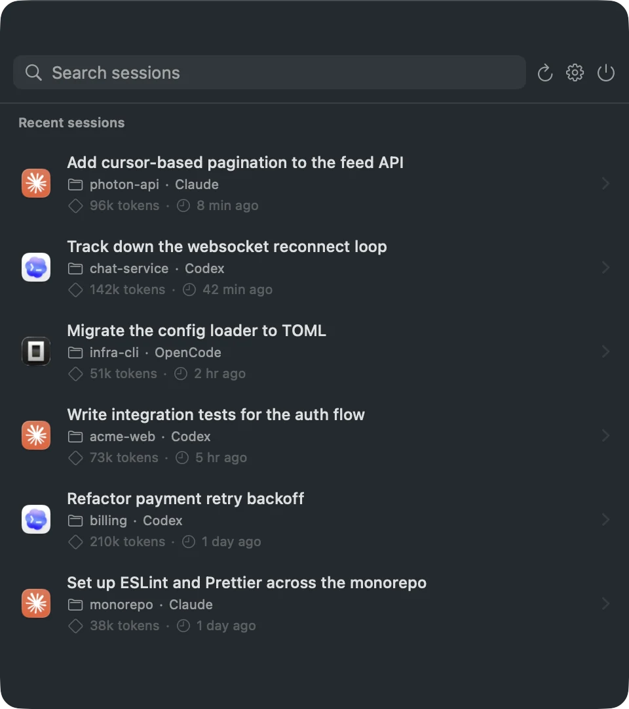
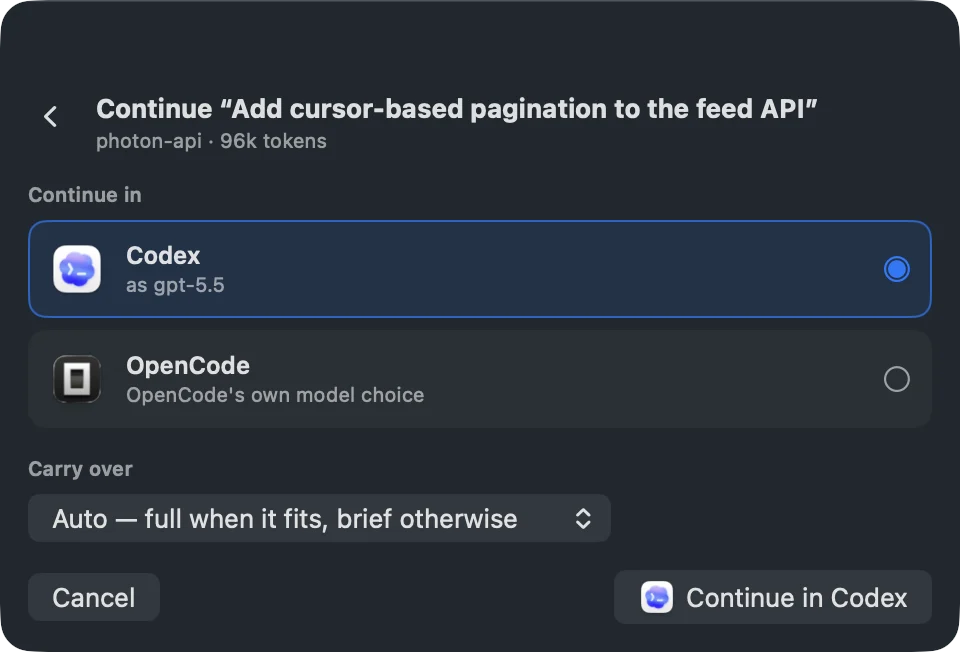
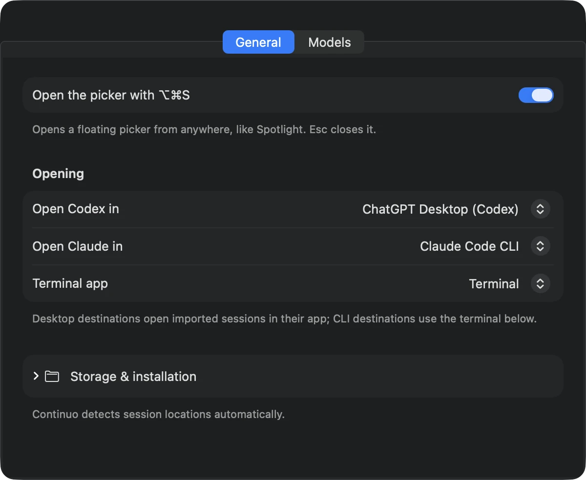

# Continuo

Continue a coding-agent session in a *different* agent. Continuo is a macOS menu-bar app that converts a recent Claude Code, Codex, or OpenCode session into another agent's native format and opens it already resumed in your chosen session destination — in any direction, on demand.

Switched tools mid-task? Hitting a model's limits? Want a fresh agent with the same context? Open the picker, pick a session, click the agent you want to continue in.

<p align="center">
  
</p>

## Install

```sh
brew install --cask yoavf/tap/continuo
```

Or download the latest `Continuo.dmg` from [Releases](https://github.com/yoavf/continuo/releases), drag it to Applications, and launch it — it's signed and notarized.

Recent sessions from `~/.claude` and `~/.codex` show up automatically. Click the menu-bar icon, or press `⌥⌘S` from anywhere, to see them.

## Using it

- **Pick a session** from the menu-bar picker — the newest across all three tools, searchable.
- **Choose where to continue it.** Click a session to open the continue panel and pick one of the other two agents.
- **Choose how much to carry over** — the full transcript when it fits the target model's context, or a handoff brief (a structured summary plus your most recent exchanges) when it wouldn't.
- **It opens resumed.** Continuo writes the target's native session file and opens the resumed session in your chosen destination.

<p align="center">
  
</p>

Settings lets you choose where Codex and Claude sessions open, select a terminal app for CLI sessions, pick target models per direction, and toggle the hotkey. Session folders are detected automatically; custom locations and installation controls stay tucked under **Storage & installation**.

<p align="center">
  
</p>

### Supported session destinations

A session destination can be a desktop agent, conventional terminal, or workspace environment. Continuo currently supports:

- **ChatGPT Desktop (Codex)** — open the converted session directly as a local Codex task.
- **Claude Desktop (Code)** — import the converted Claude Code session and open it in Claude Desktop.
- **Terminal, iTerm2, and Ghostty** — open the resumed agent directly in a new terminal session.
- **CMUX** — create a named workspace and run the resumed agent inside it. One-time password access must be enabled under CMUX → Settings → Automation.

## How it works

Native session files are read-only inputs. Continuo only ever writes its own mirror files, tracked in `bridge-state.json`; it refuses to overwrite anything it doesn't own, and never rewrites a mirror you've since continued natively (it makes a fresh one instead). Nothing runs in the background — sessions are converted only when you ask.

Converting a transcript means translating each tool call into the target agent's vocabulary (Claude's `Bash` ⇄ Codex's `exec_command`, and so on) so transplanted history reads naturally. Model matching is conservative: the source model is preserved in metadata, and the converted session gets a target-provider model from built-in family matches or your Settings defaults. Hidden provider reasoning is never carried across&nbsp;\* — only the visible conversation, tool summaries, and safe metadata.

When a session's title is just a raw prompt, and when it builds a handoff brief, Continuo uses your Mac's on-device model (Apple Intelligence, where available) to write a clean title or a custom compaction of the conversation. Nothing about your sessions is sent anywhere — the on-device model runs locally, and everything else is plain file conversion.

> \* The latest OpenAI and Anthropic reasoning models return their chain-of-thought as encrypted, provider-owned tokens that never appear in the readable transcript and can't be replayed into another provider. That reasoning is necessarily left behind when you continue a session elsewhere.

**What carries over**

- Your prompts and the agent's replies, in full
- Tool calls — name, input, and output — remapped to the target agent's equivalent operation
- Timestamps and session metadata: model, working directory, title

**What stays behind**

- Provider reasoning and thinking traces (encrypted and provider-owned — see above)
- Token counts and billing/usage data
- System prompts and other injected context (the target agent supplies its own)
- Raw file-history snapshots

OpenCode sessions are read from its `opencode.db` and written through the official `opencode import` command; models cross in with their provider prefix (`anthropic/claude-…`, `openai/gpt-…`) and cross out by stripping it.

Transfer budgets come from each model's real context limit, sourced from [models.dev](https://models.dev): a snapshot is bundled at build time and refreshed weekly at runtime, falling back to the bundle when offline.

## Similar tools

- [session-porter](https://github.com/liwala/session-porter) — a CLI for porting agent sessions between tools, if you'd rather work from the command line.

## Build

```sh
swift test
./Scripts/package-app.sh   # → dist/Continuo.app
```

Signed, notarized release DMGs are built in CI — see [docs/RELEASING.md](docs/RELEASING.md).

## License

MIT — see [LICENSE](LICENSE). Bundled model metadata is from [models.dev](https://models.dev), also MIT.
